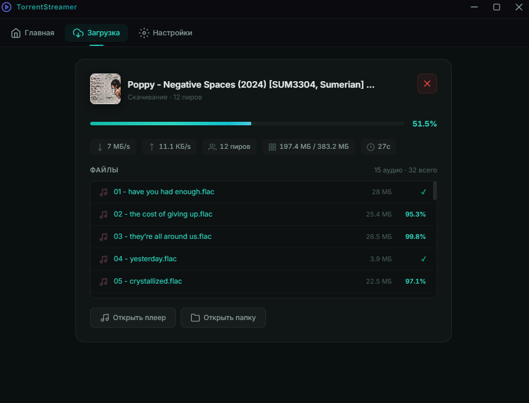

# 🎵 TorrentStreamer

**Мгновенный стриминг музыки из торрентов**

<p align="center">
  
</p>

Десктопное приложение для Windows, позволяющее **слушать музыку из торрентов прямо во время скачивания** — без ожидания полной загрузки. Поддержка `.torrent` файлов и магнет-ссылок.

---

## ⚡ Ключевые возможности

### 🔊 HTTP-стриминг в реальном времени
- Музыка начинает играть **сразу** — пока файлы ещё качаются
- Локальный HTTP-сервер с поддержкой range requests (перемотка)
- WebTorrent автоматически приоритизирует нужные куски файла

### 🎧 Встроенный аудио-плеер
- Play/Pause, Prev/Next, Seek, Volume
- Автопереход на следующий трек
- Двойной клик по треку в списке → мгновенное воспроизведение

### 🔌 Внешние плееры
| Плеер | Способ запуска |
|-------|---------------|
| **foobar2000** | `<urls> /play` (замена плейлиста) |
| **AIMP** | `/ADD_PLAY <urls>` |
| **VLC** | `--playlist-enqueue <urls>` |
| **Winamp** | `/ADD <urls>` |
| **MPC-HC** | `<url> /play` |

> Внешние плееры получают HTTP stream URLs — никаких блокировок файлов.

### 🖼️ Обложки альбомов
Автоматический поиск и отображение `cover.jpg`, `folder.jpg`, `front.png` и др.

### 📊 Подробная статистика
- Скорость скачивания / отдачи
- Количество пиров
- ETA (оставшееся время)
- Прогресс каждого файла в реальном времени

### 🎨 Премиальный дизайн
- Тил-акцент на тёмном фоне с glassmorphism-эффектами
- Светлая/тёмная тема
- Кастомный title bar
- Микро-анимации

---

## 🖥️ Скриншот

<p align="center">
  
</p>

---

## 📦 Установка

### Portable (рекомендуется)
1. Скачайте `TorrentStreamer_1.3.1_Portable.exe` из [Releases](../../releases)
2. Запустите — установка не требуется
3. Настройки сохраняются в `%APPDATA%/torrent-streamer/`

### Сборка из исходников
```bash
git clone https://github.com/dmitrymx/TorrentStreamer.git
cd TorrentStreamer
npm install
npm start           # Запуск в dev-режиме
npm run dist:portable  # Сборка portable .exe
```

---

## 🔧 Поддерживаемые форматы

| Категория | Форматы |
|-----------|---------|
| **Lossy** | MP3, OGG, AAC, WMA, OPUS, M4A |
| **Lossless** | FLAC, WAV, APE, WV, ALAC, AIFF |
| **Hi-Res** | DSF, DFF (DSD) |
| **Источники** | `.torrent` файлы, `magnet:` ссылки |

---

## 🏗️ Архитектура

```
Electron Main Process
├── TorrentEngine (WebTorrent) ──► HTTP Server (127.0.0.1:PORT)
├── IPC Handlers                        │
├── Player Launcher (CLI)               │
└── Settings Manager                    │
                                        │
Preload Bridge (contextBridge)          │
                                        │
Electron Renderer                       │
├── UI (HTML/CSS/JS)                    │
├── Built-in Player ◄──────────── <audio src="http://...">
└── File List (live progress)
```

### Файловая структура
```
TorrentStreamer/
├── src/
│   ├── main/
│   │   ├── main.js              — Electron lifecycle, окно, трей
│   │   ├── torrent-engine.js    — WebTorrent + HTTP streaming server
│   │   ├── ipc-handlers.js      — IPC мост (Main ↔ Renderer)
│   │   ├── player-launcher.js   — Запуск внешних плееров (CLI)
│   │   └── settings.js          — Настройки (JSON)
│   ├── preload/
│   │   └── preload.js           — contextBridge API
│   └── renderer/
│       ├── index.html           — UI разметка
│       ├── css/styles.css       — Стили (тёмная/светлая тема)
│       └── js/app.js            — Логика интерфейса + плеер
├── assets/                      — Иконки
├── build/                       — Ресурсы сборки
└── package.json
```

---

## ⚙️ Настройки

- **Внешний плеер** — автоопределение или ручной выбор .exe
- **Автозапуск плеера** — с настраиваемой задержкой
- **Папка загрузки** — путь по умолчанию
- **Только прослушивание** — скачивает во временную папку (автоочистка)
- **Сворачивать в трей** — при закрытии окно прячется в системный трей
- **Тема** — тёмная / светлая

---

## 🛠️ Технологии

- **[Electron](https://www.electronjs.org/) 34** — десктопная оболочка
- **[WebTorrent](https://webtorrent.io/) 2.5** — торрент-клиент с HTTP-стримингом
- **[electron-builder](https://www.electron.build/) 26** — сборка в .exe
- **Vanilla CSS** — стилизация без фреймворков

---

## 📄 Лицензия

MIT © [dmitrymx](https://github.com/dmitrymx)
